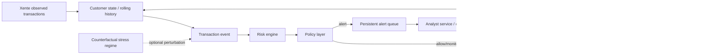

# Conceptual Model v0.2

## Design principle
Legacy prototype đã có customer profile, transaction stream, risk score, policy, analyst capacity và outcome engine. KLTN giữ phần mạnh này nhưng bổ sung **empirical event replay, dynamic state và persistent queue**.

## Baseline flow

## Simulation clock
**Baseline choice: event-driven chronological replay.**

Reason:
- Xente supplies actual `TransactionStartTime`;
- queue waiting-time and service events are central outcomes;
- event ordering matters more than artificial fixed daily batches.

A fixed timestep can still be used internally for reporting (hour/day), but event processing should preserve transaction order.

## Stateful components

### Customer
Primary persistent key: **`CustomerId`**.

Candidate state:
- rolling transaction count;
- rolling amount total/median/mean;
- inter-arrival time;
- recent product/channel mix;
- recent fraud/policy interventions only if observable/appropriate;
- optional account status;
- accumulated friction/intervention count only if used by an RQ.

### Account / Subscription
Use `AccountId` and `SubscriptionId` as nested attributes/grouping levels first.

Do not make them independent agents unless a specific interaction requires it.

### Alert Queue
Khác legacy daily capacity cut-off, queue mới cần state qua time:
- transaction/event id;
- alert arrival time;
- priority score;
- waiting time;
- backlog size;
- service start/end;
- expiry/escalation if modeled.

Candidate structural alternatives:
- FIFO;
- risk-priority;
- cost/utility-priority.

### Analyst
Baseline: **pooled service capacity**.

Heterogeneous analysts chỉ thêm nếu:
- literature provides defensible ranges; and
- heterogeneity materially answers an RQ.

### Fraud representation
Observed Xente `FraudResult` is ground truth for baseline replay.

Counterfactual stress tests can perturb:
- fraud intensity;
- amount mix;
- transaction volume;
- selected pattern distributions.

Do not claim sophisticated fraudster cognition without evidence.

## Risk engine
Risk engine là component, không phải contribution chính.

### Baseline candidate
**Regularized logistic regression** on leakage-safe chronological features.

Why:
- limited positive events in Xente;
- interpretable;
- stable baseline;
- easier to separate risk-model uncertainty from policy effects.

### Robustness candidate
XGBoost/LightGBM can be added later to test whether policy conclusions depend on the score model.

Legacy XGBoost code is reference only; train/evaluate again on the Xente design.

## Policy candidates
Recommended core set:
1. **Fixed-threshold baseline** — alerts above a validated operating threshold.
2. **Capacity-aware risk-priority** — rank alerts by risk score and serve under capacity.
3. **Cost-sensitive priority** — rank/serve using expected utility under explicit cost assumptions.

`Recall-first` should initially be treated as an **operating-point selection strategy**, not a separate policy family.

## Outcome metrics
- fraud loss realized/prevented proxy;
- false-positive count/rate;
- customer-friction proxy;
- alerts generated;
- analyst workload;
- backlog size;
- mean/P95 waiting time;
- overflow/expiry;
- operational cost / simulated utility.

## Minimum feedback needed
Để giữ dynamic/ABM framing, state phải ảnh hưởng bước sau:
- customer history -> risk features;
- policy -> alert arrivals;
- backlog -> waiting time/service;
- review delay -> outcome if a defensible mechanism is specified;
- intervention -> future customer/account state only if justified.

Nếu final model không cần feedback beyond queue mechanics, thesis should use the more conservative label **dynamic policy simulation** instead of forcing ABM.

## Decisions
- [x] Primary data: Xente.
- [x] CustomerId = primary stateful entity.
- [x] Baseline = chronological observed-event replay.
- [x] Simulation clock = event-driven.
- [x] Baseline risk engine candidate = regularized logistic regression.
- [x] Core policy families = fixed threshold / capacity-aware / cost-sensitive.
- [ ] Queue service-time distribution.
- [ ] Analyst capacity range.
- [ ] Review-delay effect on loss/recovery.
- [ ] Customer-friction proxy.
