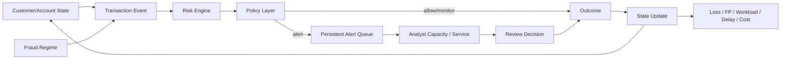

# Conceptual Model v0.2

## Design principle
Legacy prototype đã có customer profile, transaction stream, risk score, policy, analyst capacity và outcome engine. KLTN giữ phần mạnh này nhưng bổ sung **dynamic state và persistent queue**.

## Core flow

## Stateful components

### Customer / Account
Candidate persistent state:
- rolling transaction history;
- typical amount/frequency profile;
- recent velocity;
- account status;
- accumulated friction/intervention count nếu cần cho RQ.

### Alert Queue
Khác legacy daily capacity cut-off, queue mới cần state qua timestep:
- arrival time;
- priority;
- waiting time;
- backlog size;
- service completion;
- expiry/escalation nếu có.

### Analyst
Baseline nên bắt đầu bằng pooled service capacity. Heterogeneous analysts chỉ thêm nếu evidence cho thấy cần.

### Fraud representation
Core dùng bounded fraud regimes/scenarios. Không giả định sophisticated fraudster cognition nếu chưa có grounding.

## Risk engine
Risk engine là component, không phải contribution chính.

Candidate baseline:
- interpretable model / logistic / EBM; hoặc
- XGBoost nếu empirical performance cần thiết.

Legacy XGBoost code có thể làm reference nhưng phải train/evaluate lại trên primary data hoặc design mới.

## Policy candidates
Từ legacy repo:
- fixed threshold;
- recall-first threshold;
- capacity-aware priority;
- cost-sensitive priority.

Final thesis chỉ cần 2–3 policy tạo khác biệt mechanism rõ.

## Outcome metrics
- fraud loss realized/prevented;
- false-positive count/rate;
- customer-friction proxy;
- alerts generated;
- analyst workload;
- backlog;
- mean/P95 waiting time;
- overflow/expiry;
- operational cost / simulated utility.

## Minimum feedback needed
Để giữ dynamic/ABM framing, ít nhất một số state phải ảnh hưởng bước sau:
- transaction history → features/risk;
- backlog → review delay;
- delayed review → prevention/loss outcome;
- intervention → account state nếu cần.

Nếu các feedback này không cần cho RQ, nên gọi model là **dynamic policy simulation** thay vì ép nhãn ABM.

## Open decisions
- [ ] Event-driven hay fixed timestep?
- [ ] Customer hay Account là primary agent/stateful entity?
- [ ] FIFO, risk-priority hay hybrid queue?
- [ ] Review delay tác động outcome như thế nào?
- [ ] Risk model nào vừa đủ?
- [ ] Friction proxy nào có evidence?
